# Architecture

**Analysis Date:** 2026-04-20

## System Overview

PickleIQ is a three-tier architecture for Brazilian pickleball paddle intelligence. The platform monitors prices from multiple retailers, provides AI-powered recommendations via RAG, and monetizes through affiliate links.

**High-Level Purpose:**
- Compare prices and specifications of pickleball paddles from Brazilian retailers
- Provide personalized recommendations through a 7-step quiz
- Offer AI-powered chat with semantic search (RAG)
- Track affiliate clicks for monetization

## Component Breakdown

### Backend (FastAPI)
- **Location:** `/home/diego/Projetos/picklepicker/backend/`
- **Framework:** FastAPI with async/await
- **Port:** 8000 (dev), Railway (production)
- **Key Features:**
  - RESTful API endpoints
  - SSE streaming for chat
  - PostgreSQL connection pooling via `psycopg_pool`
  - Structured logging with `structlog`
  - Telegram error alerting with rate limiting

### Frontend (Next.js 14)
- **Location:** `/home/diego/Projetos/picklepicker/frontend/`
- **Framework:** Next.js 14 App Router with TypeScript
- **Port:** 3000 (dev), Vercel (production)
- **Key Features:**
  - Server Components and Client Components
  - Clerk authentication
  - TailwindCSS styling
  - Quiz flow (7-step)
  - Chat interface with SSE streaming

### Pipeline (Scrapers)
- **Location:** `/home/diego/Projetos/picklepicker/pipeline/`
- **Purpose:** Data collection and processing
- **Key Features:**
  - Firecrawl API for HTML extraction
  - Shopify JSON API for native integrations
  - RapidFuzz for deduplication
  - Jina AI for embeddings
  - GitHub Actions cron jobs

## Data Flow

### Price Monitoring Flow
```
GitHub Actions Cron
    ↓
Scrapers (crawlers/)
    ↓ (raw HTML/JSON)
Product Extraction
    ↓
RapidFuzz Dedup (pipeline/dedup/)
    ↓
INSERT price_snapshots
    ↓
REFRESH MATERIALIZED VIEW latest_prices
    ↓
Backend API (FastAPI)
    ↓
Frontend Catalog (Next.js)
```

### RAG Recommendation Flow
```
User Query
    ↓
Jina AI Embedding (768d)
    ↓
pgvector Semantic Search
    ↓
Top 5 Similar Paddles
    ↓
Context Assembly
    ↓
Groq LLM (Llama 3.3 70B)
    ↓
Streaming SSE Response
    ↓
Frontend Chat UI
```

### User Quiz Flow
```
Quiz Step 1-7 (frontend/)
    ↓
User Profile (level, style, budget)
    ↓
Backend /chat endpoint
    ↓
RAG Agent (semantic search)
    ↓
Groq LLM streaming
    ↓
Recommendation Cards
```

## API Design

### REST Endpoints

| Endpoint | Method | Purpose |
|----------|--------|---------|
| `/api/v1/paddles` | GET | List paddles with filters (brand, price_range, skill_level) |
| `/api/v1/paddles/{id}` | GET | Get single paddle with specs and prices |
| `/api/v1/paddles/{id}/similar` | GET | Vector similarity search |
| `/api/v1/price-history/{id}` | GET | Historical price data |
| `/api/v1/users` | POST | Create user |
| `/api/v1/price-alerts` | POST | Create price alert |
| `/api/v1/affiliate-clicks` | POST | Track affiliate click |
| `/api/affiliate/{retailer}` | GET | Generate affiliate link |
| `/api/v1/embeddings` | POST | Generate embedding |
| `/health` | GET | Health check |

### Streaming Endpoints

| Endpoint | Method | Protocol | Purpose |
|----------|--------|---------|---------|
| `/chat` | POST | SSE | Streaming chat with RAG |

**SSE Events:**
- `recommendations` — Top-3 paddle recommendations
- `reasoning` — LLM explanation
- `done` — Metadata (latency, tokens, model)
- `error` — Error event

### Admin Endpoints

| Endpoint | Method | Auth |
|----------|--------|------|
| `/api/v1/admin/health` | GET | ADMIN_SECRET Bearer token |
| `/api/v1/admin/price-history/{paddle_id}` | GET | ADMIN_SECRET Bearer token |

## Database Schema

### Core Tables

| Table | Purpose | Key Fields |
|-------|---------|-----------|
| `paddles` | Master catalog | id, name, brand, model, skill_level, price_min_brl, model_slug, title_hash |
| `retailers` | Retailer config | id, name, base_url, integration_type |
| `price_snapshots` | Append-only price history | paddle_id, retailer_id, price_brl, affiliate_url, scraped_at |
| `latest_prices` | Materialized view (current prices) | paddle_id, retailer_id, price_brl, in_stock |
| `paddle_specs` | Technical specs | paddle_id, swingweight, twistweight, weight_oz, grip_size |
| `paddle_embeddings` | Vector embeddings | paddle_id, embedding (vector(768)) |

### User Tables

| Table | Purpose |
|-------|---------|
| `users` | User accounts |
| `price_alerts` | Alert subscriptions |
| `user_profiles` | Quiz profile persistence |

### Tracking Tables

| Table | Purpose |
|-------|---------|
| `affiliate_clicks` | Click attribution |
| `review_queue` | Manual review items |
| `dead_letter_queue` | Failed extraction storage |
| `data_quality_checks` | Validation failure tracking |

### Vector Search

```sql
-- Semantic similarity search via cosine distance
SELECT
    p.id, p.name, p.brand,
    1 - (e.embedding <=> query_vector) as similarity
FROM paddles p
JOIN paddle_embeddings e ON p.id = e.paddle_id
ORDER BY e.embedding <=> query_vector
LIMIT 10;
```

### Materialized View Pattern

```sql
CREATE MATERIALIZED VIEW latest_prices AS
SELECT DISTINCT ON (paddle_id, retailer_id)
    paddle_id, retailer_id, price_brl, currency, in_stock, affiliate_url, scraped_at
FROM price_snapshots
ORDER BY paddle_id, retailer_id, scraped_at DESC;

-- Refresh after each crawler run
REFRESH MATERIALIZED VIEW CONCURRENTLY latest_prices;
```

## Authentication & Authorization

### Frontend Authentication
- **Provider:** Clerk
- **Purpose:** User account management, social login
- **Protected Routes:** `/admin/*`

### Admin Authorization
- **Method:** Bearer token via `ADMIN_SECRET` env var
- **Endpoints:** `/api/v1/admin/*`

### API Security

| Concern | Implementation |
|---------|----------------|
| SQL Injection | Parameterized queries in all DB calls |
| CORS | Configured origins in FastAPI middleware |
| Rate Limiting | Telegram alerts rate limited (1/60s per type) |
| Input Validation | Pydantic schemas on all endpoints |

## Deployment Architecture

### Infrastructure

```mermaid
graph TB
    subgraph "CI/CD"
        GA[GitHub Actions]
    end

    subgraph "Application"
        R[Railway - Backend]
        V[Vercel - Frontend]
    end

    subgraph "Data"
        S[Supabase - PostgreSQL + pgvector]
    end

    subgraph "External Services"
        G[Groq - LLM]
        J[Jina AI - Embeddings]
        FC[Firecrawl - Scraping]
        T[Telegram - Alerts]
        CL[Clerk - Auth]
    end

    GA --> R
    GA --> V
    R --> S
    V --> R
    R --> G
    R --> J
    R --> FC
    R --> T
    V --> CL
```



### Deployment Targets

| Service | Platform | Environment Variables |
|----------|-----------|---------------------|
| Backend (FastAPI) | Railway | DATABASE_URL, GROQ_API_KEY, JINA_API_KEY, ADMIN_SECRET |
| Frontend (Next.js) | Vercel | NEXT_PUBLIC_API_URL, NEXT_PUBLIC_CLERK_PUBLISHABLE_KEY |
| Database | Supabase | Managed, pgvector extension enabled |
| Scraping | GitHub Actions | Same as backend + TELEGRAM_BOT_TOKEN |

### Local Development

- **Database:** Docker Compose with `pgvector/pgvector:pg16`
- **Backend:** `uvicorn` with hot reload
- **Frontend:** `npm run dev`
- **Orchestration:** `make dev` (starts all services)

## Cross-Cutting Concerns

### Logging
- **Framework:** `structlog`
- **Format:** JSON-structured logs
- **Correlation:** Request ID via middleware
- **Configuration:** `backend/app/logging_config.py`

```python
logger.info(
    "http.request",
    request_id=request_id,
    method=request.method,
    path=request.url.path
)
```

### Error Handling
- **Global Exception Handler:** Catches unhandled exceptions, logs, sends Telegram alert
- **Middleware Pattern:** HTTP request/response logging with duration
- **Alerting:** Fire-and-forget Telegram notifications with rate limiting (1/60s per type)

```python
@app.exception_handler(Exception)
async def global_exception_handler(request: Request, exc: Exception):
    logger.error("unhandled.exception", error=str(exc))
    asyncio.create_task(alerter.send_alert(
        severity="ERROR",
        title="API Exception",
        details=str(exc)[:200]
    ))
    return JSONResponse(status_code=500, content={"error": "Internal server error"})
```

### Configuration Management
- **Environment Variables:** Required via `.env` files
- **Key Configs:**
  - `DATABASE_URL` — PostgreSQL connection
  - `GROQ_API_KEY` — LLM access
  - `Jina_API_KEY` — Embedding generation
  - `FIRECRAWL_API_KEY` — Scraping (optional)
  - `ADMIN_SECRET` — Admin auth
  - `TELEGRAM_BOT_TOKEN` — Error alerts

### Caching
- **Layer:** `backend/app/cache.py`
- **Purpose:** API response caching for repeated queries

---

*Architecture analysis: 2026-04-20*
