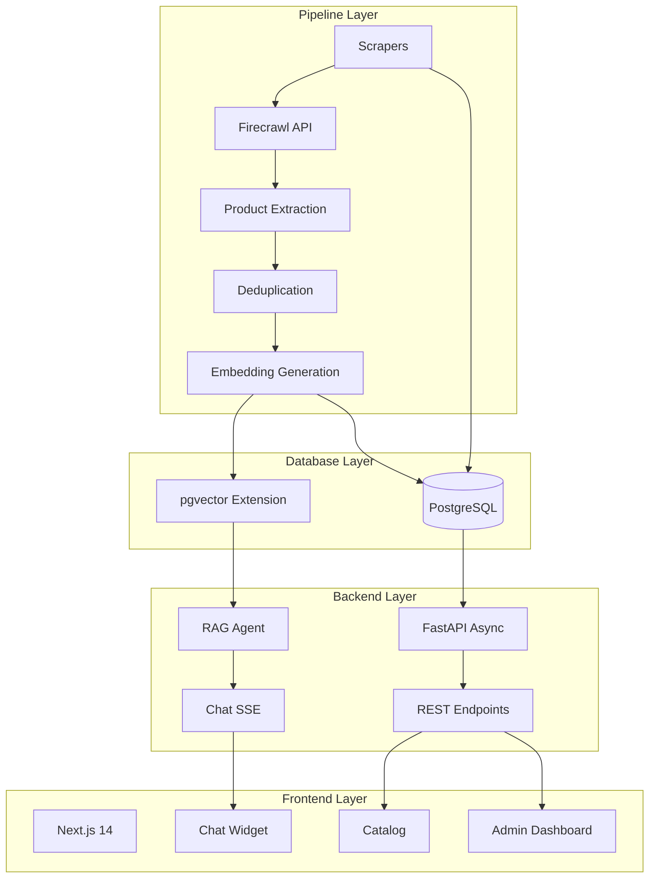
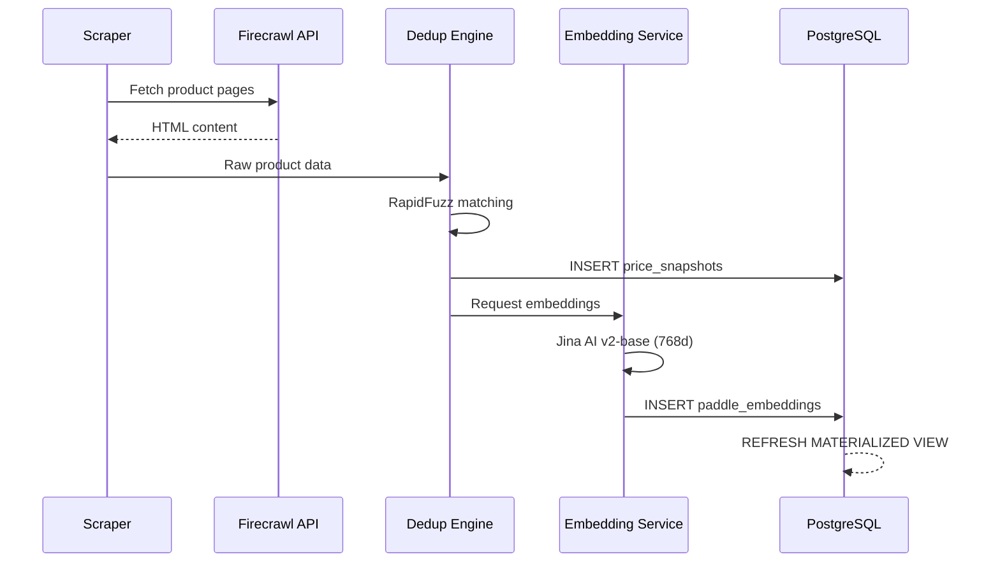
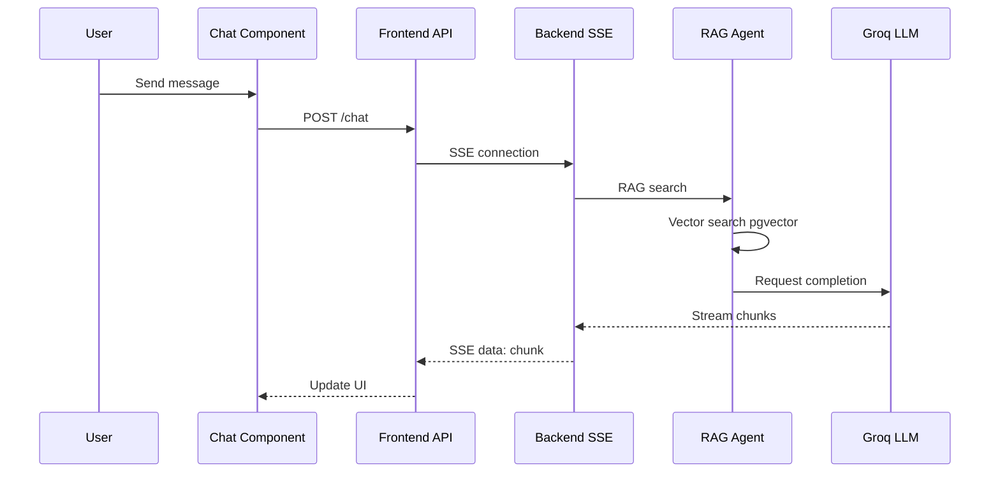
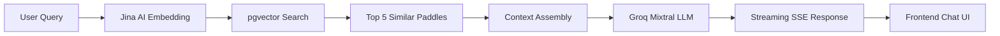
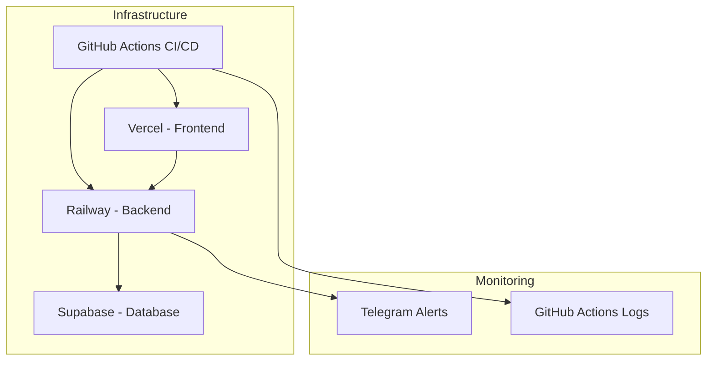

# PickleIQ Architecture

**Version:** 1.4.0
**Last Updated:** 2026-04-12

---

## Overview

PickleIQ is a three-tier architecture for Brazilian pickleball paddle intelligence. The platform monitors prices from multiple retailers, provides AI-powered recommendations via RAG, and monetizes through affiliate links.

### Architecture Layers



---

## Pipeline Layer

The pipeline layer handles data collection, processing, and vectorization. Runs via GitHub Actions cron jobs.

### Scrapers

Located in `pipeline/crawlers/`

| Retailer | Integration | Status |
|-----------|-------------|--------|
| Brazil Pickleball Store | Firecrawl API | Active |
| Drop Shot Brasil | Firecrawl API | Active |
| Mercado Livre | ML API | Active |

**Implementation Pattern:**
```python
from tenacity import retry, stop_after_attempt, wait_exponential

@retry(stop=stop_after_attempt(3), wait=wait_exponential(multiplier=1, min=1, max=10))
async def crawl_retailer():
    # Fetch HTML via Firecrawl
    # Extract product data
    # Return structured data
```

### Data Processing Pipeline



**Key Components:**

- **Deduplication** (`pipeline/dedup/`): Uses RapidFuzz for fuzzy string matching to identify duplicate products
- **Embeddings** (`pipeline/embeddings/`): Jina AI v2-base (768 dimensions) with Hugging Face fallback
- **Quality Metrics** (`pipeline/db/quality_metrics.py`): Tracks scraper health and data quality

---

## Database Layer

PostgreSQL with pgvector extension. Raw SQL (no ORM) via `psycopg_pool.AsyncConnectionPool`.

### Schema Overview

| Table | Purpose | Key Fields |
|-------|---------|-----------|
| `paddles` | Master catalog | id, name, brand, model, skill_level, price_min_brl |
| `retailers` | Retailer config | id, name, base_url, integration_type |
| `price_snapshots` | Append-only price history | paddle_id, retailer_id, price_brl, affiliate_url, scraped_at |
| `latest_prices` | Current prices (materialized view) | paddle_id, retailer_id, price_brl, in_stock |
| `paddle_specs` | Technical specs | paddle_id, swingweight, twistweight, weight_oz, grip_size |
| `paddle_embeddings` | Vector embeddings | paddle_id, embedding (vector(768)) |
| `review_queue` | Manual review items | type, paddle_id, related_paddle_id, status |
| `users` | User accounts | id, email, created_at |
| `price_alerts` | Alert subscriptions | user_id, paddle_id, target_price_brl, is_active |
| `user_profiles` | Quiz profiles | user_id, level, style, budget_max |
| `affiliate_clicks` | Click tracking | paddle_id, retailer, source, medium, created_at |

### Materialized View Pattern

```sql
CREATE MATERIALIZED VIEW latest_prices AS
SELECT DISTINCT ON (paddle_id, retailer_id)
    paddle_id, retailer_id, price_brl, currency, in_stock, affiliate_url, scraped_at
FROM price_snapshots
ORDER BY paddle_id, retailer_id, scraped_at DESC;
```

Refresh strategy: `REFRESH MATERIALIZED VIEW CONCURRENTLY latest_prices` after each crawler run.

### Vector Search

```sql
-- Semantic similarity search via cosine distance
SELECT
    p.id, p.name, p.brand, p.model,
    1 - (e.embedding <=> query_vector) as similarity
FROM paddles p
JOIN paddle_embeddings e ON p.id = e.paddle_id
ORDER BY e.embedding <=> query_vector
LIMIT 10;
```

---

## Backend Layer

FastAPI async application with structured logging and error alerting.

### Application Structure

```
backend/
├── app/
│   ├── main.py                 # FastAPI entrypoint
│   ├── api/                   # REST endpoints
│   │   ├── paddles.py         # GET /paddles, /paddles/{id}, /paddles/{id}/similar
│   │   ├── chat.py            # POST /chat (SSE streaming)
│   │   ├── health.py          # GET /health
│   │   ├── price_history.py   # GET /price-history/{id}
│   │   ├── embeddings.py      # POST /embeddings
│   │   ├── users.py           # POST /users
│   │   ├── price_alerts.py    # POST /price-alerts
│   │   └── affiliate_clicks.py # POST /affiliate-clicks
│   ├── agents/
│   │   ├── rag_agent.py       # RAG with pgvector semantic search
│   │   └── eval_gate.py      # LLM selection (mock)
│   ├── middleware/
│   │   └── alerts.py         # Telegram alerting with rate limiting
│   ├── routers/
│   │   └── affiliate.py      # Affiliate link generation
│   ├── db.py                 # AsyncConnectionPool
│   ├── schemas.py            # Pydantic models
│   ├── prompts.py            # PT-BR prompt templates
│   └── cache.py              # Caching layer
├── workers/
│   └── price_alerts.py       # Background alert processing
└── tests/
    └── conftest.py           # pytest-asyncio fixtures
```

### API Endpoints

| Endpoint | Method | Purpose |
|----------|--------|---------|
| `/api/v1/paddles` | GET | List paddles with filters |
| `/api/v1/paddles/{id}` | GET | Get single paddle with specs and prices |
| `/api/v1/paddles/{id}/similar` | GET | Vector similarity search |
| `/chat` | POST | Streaming chat (SSE) with Groq Mixtral |
| `/health` | GET | Health check |
| `/price-history/{id}` | GET | Historical price data |
| `/embeddings` | POST | Generate embedding |
| `/api/v1/users` | POST | Create user |
| `/api/v1/price-alerts` | POST | Create price alert |
| `/api/v1/affiliate-clicks` | POST | Track affiliate click |
| `/api/affiliate/{retailer}` | GET | Generate affiliate link |

### RAG Agent

Located in `backend/app/agents/rag_agent.py`

**Flow:**
```python
# 1. Convert user query to embedding
query_embedding = await generate_embedding(user_query)

# 2. Semantic search via pgvector
similar_paddles = await vector_search(query_embedding, top_k=5)

# 3. Build context
context = format_paddles_context(similar_paddles)

# 4. Call LLM (Groq Mixtral 8x7B)
response = await groq_client.chat.completions.create(
    model="mixtral-8x7b-32768",
    messages=[{"role": "user", "content": prompt + context}]
)
```

**Streaming SSE Implementation:**
```python
from fastapi.responses import StreamingResponse

async def stream_chat(messages: List[Message]):
    async for chunk in groq_stream(messages):
        yield f"data: {chunk}\n\n"
```

### Connection Pool

```python
from psycopg_pool import AsyncConnectionPool

pool = AsyncConnectionPool(
    conninfo=DATABASE_URL,
    min_size=5,
    max_size=20,
    open=False
)

async def get_pool():
    await pool.open()
    return pool
```

### Error Handling & Alerting

**Middleware Pattern:**
```python
@app.middleware("http")
async def logging_middleware(request, call_next):
    request_id = str(uuid.uuid4())
    start = time.time()
    response = await call_next(request)
    duration = time.time() - start

    logger.info("http.response", request_id=request_id, status=response.status_code)

    return response
```

**Global Exception Handler:**
```python
@app.exception_handler(Exception)
async def global_exception_handler(request, exc):
    logger.error("unhandled.exception", error=str(exc))

    # Send Telegram alert (fire-and-forget, rate limited)
    asyncio.create_task(alerter.send_alert(
        severity="ERROR",
        title="API Exception",
        details=str(exc)[:200]
    ))

    return JSONResponse(status_code=500, content={"error": "Internal server error"})
```

---

## Frontend Layer

Next.js 14 App Router with TypeScript. Clerk authentication. Tailwind CSS styling.

### Application Structure

```
frontend/src/
├── app/                    # Pages
│   ├── page.tsx            # Landing (quiz CTA)
│   ├── quiz/               # 7-step quiz
│   ├── chat/               # Chat interface
│   ├── paddles/            # Catalog
│   ├── compare/            # Comparator
│   ├── admin/              # Admin dashboard
│   ├── blog/               # Blog posts
│   └── api/               # API routes
├── components/
│   ├── layout/             # Layout components
│   ├── chat/               # Chat widget, message bubbles
│   ├── quiz/               # Quiz steps
│   ├── products/           # Paddle cards, table
│   ├── admin/              # Admin panels
│   └── ui/                # Reusable UI components
├── lib/
│   ├── api.ts              # Backend API client
│   ├── auth.ts             # Clerk auth utilities
│   ├── tracking.ts         # Affiliate tracking
│   ├── seo.ts             # SEO metadata
│   └── admin-api.ts       # Admin API client
├── types/
│   └── paddle.ts          # TypeScript paddle types
├── hooks/
│   └── use-announcer.ts   # Custom hook
└── tests/
    └── setup.ts            # Vitest setup
```

### Page Routes

| Route | Component | Key Features |
|-------|-----------|--------------|
| `/` | LandingClient | Quiz CTA above-the-fold, trust signals |
| `/quiz` | QuizPage | 7-step quiz, profile collection |
| `/chat` | ChatPage | Split-panel, SSE streaming, product sidebar |
| `/paddles` | CatalogPage | Sortable table, grid toggle, filters |
| `/paddles/[id]` | PaddleDetail | Specs, price history, comparison |
| `/compare` | ComparePage | Side-by-side comparison, radar chart |
| `/admin` | AdminPage | Dashboard, manual review queue |
| `/blog` | BlogPage | Content marketing pages |

### Chat Component Flow



### API Client Pattern

```typescript
// lib/api.ts
const API_BASE = process.env.NEXT_PUBLIC_API_URL || 'http://localhost:8000';

export async function getPaddles(filters: PaddleFilters): Promise<Paddle[]> {
  const params = new URLSearchParams(filters as any);
  const res = await fetch(`${API_BASE}/api/v1/paddles?${params}`);
  return res.json();
}

export async function streamChat(
  messages: Message[],
  onChunk: (chunk: string) => void
): Promise<void> {
  const res = await fetch(`${API_BASE}/chat`, {
    method: 'POST',
    body: JSON.stringify({ messages }),
  });

  const reader = res.body.getReader();
  const decoder = new TextDecoder();

  while (true) {
    const { done, value } = await reader.read();
    if (done) break;

    const text = decoder.decode(value);
    for (const line of text.split('\n')) {
      if (line.startsWith('data: ')) {
        onChunk(line.slice(6));
      }
    }
  }
}
```

### Clerk Authentication

```typescript
// middleware.ts
import { clerkMiddleware, createRouteMatcher } from '@clerk/nextjs/server';

const isPublicRoute = createRouteMatcher(['/', '/quiz', '/paddles', '/chat']);

export default clerkMiddleware((auth, req) => {
  if (isPublicRoute(req)) return;
  // Protect admin routes
});

export const config = {
  matcher: ['/((?!.*\\..*|_next).*)', '/', '/(api|trpc)(.*)'],
};
```

---

## Data Flow

### Price Monitoring Flow

```mermaid
graph LR
    A[GitHub Actions Cron] --> B[Scraper Runner]
    B --> C[Firecrawl API]
    C --> D[HTML Content]
    D --> E[Product Extraction]
    E --> F[RapidFuzz Dedup]
    F --> G[INSERT price_snapshots]
    G --> H[REFRESH latest_prices MV]
    H --> I[Backend API]
    I --> J[Frontend Catalog]
```



**Key Characteristics:**
- **Append-only** `price_snapshots` table preserves all historical data
- **Materialized view** `latest_prices` provides fast current price lookups
- **Deduplication** prevents duplicate entries across retailer scrapes

### Recommendation Flow



**Latency Budget:** < 3s P95
- Embedding generation: ~100ms
- Vector search: ~50ms
- LLM generation: ~2s (streaming)

---

## Technology Decisions

### Raw SQL vs ORM

**Decision:** Raw psycopg with `AsyncConnectionPool`

**Rationale:**
- Simpler dependency stack (no ORM migrations)
- Direct control over SQL queries (performance optimization)
- Materialized views and vector search are SQL-native
- `pipeline/db/schema.sql` as single source of truth

**Trade-offs:**
- No compile-time column validation
- Manual query construction (careful review required)
- No automatic schema migrations

### Tenacity Retry

**Decision:** All crawlers use `@retry` decorator with exponential backoff

**Rationale:**
- Retailer APIs are unreliable
- Network failures are common
- Prevents cascade failures

**Configuration:**
```python
@retry(stop=stop_after_attempt(3), wait=wait_exponential(multiplier=1, min=1, max=10))
```

### Structlog

**Decision:** Structured logging with `structlog`

**Rationale:**
- JSON-structured logs for easy parsing
- Request ID correlation across services
- Production monitoring integration

**Example:**
```python
logger.info("http.request", request_id=request_id, method=request.method, path=request.url.path)
```

### Jina AI Embeddings

**Decision:** Jina AI v2-base (768d) with Hugging Face fallback

**Rationale:**
- Free tier available
- 768d dimensions balance precision/performance
- Brazilian Portuguese language support
- Hugging Face fallback for resilience

**Alternative Considered:** OpenAI embeddings (removed due to cost)

### Groq LLM

**Decision:** Groq Mixtral 8x7B for chat

**Rationale:**
- Fast inference (~50 tokens/sec)
- Streaming support
- Cost-effective vs OpenAI
- High-quality responses for PT-BR

### Clerk Authentication

**Decision:** Clerk for frontend auth

**Rationale:**
- Seamless Next.js integration
- Managed auth (no user table maintenance)
- Social login support
- GDPR compliant

---

## Security Considerations

### API Security

| Concern | Implementation |
|---------|----------------|
| SQL Injection | Parameterized queries in all DB calls |
| CORS | Configured origins in FastAPI middleware |
| Rate Limiting | Telegram alerts rate limited (1/60s per type) |
| Admin Access | Bearer token via `ADMIN_SECRET` env var |
| Input Validation | Pydantic schemas on all endpoints |

### Data Privacy

| Concern | Implementation |
|---------|----------------|
| User Data | Minimal collection (email only via Clerk) |
| Quiz Profiles | Optional, cross-device (Phase 23) |
| IP Logging | Stored in `affiliate_clicks` for analytics |
| Third-party | Clerk and Supabase handle PII |

### Environment Variables

**Required:**
- `DATABASE_URL`: PostgreSQL connection string
- `GROQ_API_KEY`: LLM access
- `JINA_API_KEY`: Embedding generation
- `Clerk Secret Keys`: Auth

**Optional:**
- `FIRECRAWL_API_KEY`: Scraping
- `TELEGRAM_BOT_TOKEN`: Error alerts
- `ADMIN_SECRET`: Admin access

---

## Deployment Architecture

### Production Infrastructure



### Deployment Targets

| Service | Platform | Environment Variables |
|----------|-----------|---------------------|
| Backend (FastAPI) | Railway | `DATABASE_URL`, `GROQ_API_KEY`, `JINA_API_KEY`, `FIRECRAWL_API_KEY` |
| Frontend (Next.js) | Vercel | `NEXT_PUBLIC_API_URL`, `NEXT_PUBLIC_CLERK_PUBLISHABLE_KEY` |
| Database (PostgreSQL) | Supabase | Managed hosting, pgvector extension |
| Scraping | GitHub Actions | Same as backend + `TELEGRAM_BOT_TOKEN` |

### CI/CD Workflows

Located in `.github/workflows/`

| Workflow | Trigger | Purpose |
|----------|---------|---------|
| `deploy.yml` | Push to main | Deploy backend + frontend |
| `test.yml` | Push to any | Run pytest + vitest |
| `scrape.yml` | Cron (daily) | Run all scrapers |
| `lighthouse.yml` | Cron (weekly) | Performance auditing |
| `price-alerts.yml` | Cron (hourly) | Check and send alerts |
| `nps-survey.yml` | Cron (monthly) | NPS survey workflow |

---

## Scalability Patterns

### Database Scaling

**Current:** Single Supabase instance (pgvector)

**Future Path:**
1. Read replicas for read-heavy queries
2. Separate vector store (Weaviate/Pinecone) for semantic search
3. CDN for static paddle images

### Backend Scaling

**Current:** Railway (auto-scaling)

**Future Path:**
1. Kubernetes deployment for horizontal scaling
2. Redis caching for repeated queries
3. Message queue (RabbitMQ) for async processing

### Frontend Scaling

**Current:** Vercel (edge network)

**Optimizations:**
1. ISR (Incremental Static Regeneration) for catalog pages
2. Image optimization (next/image)
3. Client-side caching (Service Worker)

---

## Development Workflow

### Local Development

```bash
# Start all services
make dev
# DB (Docker) + Backend (uvicorn) + Frontend (npm dev)

# Run tests
make test
# pytest (backend) + vitest (frontend)

# DB operations
make db-shell
# Open psql for direct SQL
```

### Testing Strategy

**Backend Tests:**
- `pytest-asyncio` with `auto` mode
- Mock DB pool via autouse conftest fixture
- Coverage threshold: 80%
- 174 passing tests (v1.4.0)

**Frontend Tests:**
- `vitest` with jsdom environment
- Component unit tests
- API client tests
- 182 passing tests (v2.1.0)

**E2E Tests:**
- Scraper validation with real DB
- Playwright for user flows
- Lighthouse CI for performance

---

## Performance Targets

| Metric | Target | Current |
|--------|---------|---------|
| Chat response latency (P95) | < 3s | ~2.5s |
| Catalog page load (LCP) | < 2.5s | ~2.2s |
| Vector search latency | < 100ms | ~50ms |
| Scraper success rate | > 95% | ~92% |
| Uptime (monthly) | > 99.5% | ~98% |

---

## Known Limitations

1. **No LangChain**: Direct API calls to LLMs (intentional simplicity)
2. **Mock Eval Gate**: `eval_gate.py` returns hardcoded scores
3. **Duplicate Pipeline**: `backend/pipeline/` reference may be stale
4. **Inconsistent Crawler Guards**: Only Mercado Livre has `__main__` guard
5. **No .pre-commit-config**: No automated formatting enforcement

---

## Future Roadmap

### Phase 21: Price Alerts CRUD
- Implement POST /price-alerts endpoint
- Background worker for alert checking
- Email notification system

### Phase 22: Affiliate Click Tracking
- DB persistence for clicks
- Attribution tracking
- Analytics dashboard

### Phase 23: Quiz Profile Persistence
- Cross-device profile sync
- Clerk user account integration
- Personalization engine

---

## References

- **[AGENTS.md](../AGENTS.md)** — Project knowledge base
- **[DESIGN.md](../DESIGN.md)** — Design system v5.0
- **[TODOS.md](../TODOS.md)** — Deferred work items
- **[CONTRIBUTING.md](../CONTRIBUTING.md)** — Development workflow
- **[README.md](../README.md)** — Project overview
